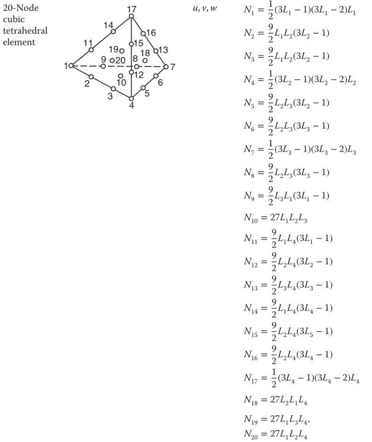

# High order FEM

## Shape function

## Coordinate

Displacement coordinate is  $\vec \phi(\vec X) = (u, v, w)$ with reference coordinate $\vec X = (x, y, z)$.

For the tetramesh with $M$ nodes, the reference coordinate is $\vec X_e$ and the displacement coordinate is $\vec \phi_e$. 

Reference coordinate of Node $i$ is $\vec X_{e}[i] = (x_{i}, y_{i}, z_{i})$.

Displacement coordinate of Node $i$ is $\vec \phi_{e}[i] = (u_{i}, v_{i}, w_{i})$.

For tetrahedral element with $m$ nodes of idx $i_1, i_2, ... i_m$:
$$
\vec \phi = \sum_{j=1}^m N_j \vec \phi_{e}[i_j]
$$
or:
$$
u = \sum_{j=1}^m N_j u_{i_j} \\
v = \sum_{j=1}^m N_j v_{i_j} \\
w = \sum_{j=1}^m N_j w_{i_j}
$$

## Force

When $d \vec \phi_{e}$ is a one hot vector (take $d\vec \phi_{e}[l] = (dx, 0, 0)$ as example),

the inertia force is:
$$
\mathbf f_{inertia}(\ddot {\vec \phi_e}) = \int_{\Omega} \rho \ddot {\vec{\phi}} \cdot d \vec \phi \, d\Omega
\\ = \sum_{k=1}^n \int_{\Omega_k} \rho \ddot {\vec{\phi}} \cdot d \vec \phi \, d\Omega_k
\\ = \sum_{k=1}^n \int_{\Omega_k} \rho ({\sum_{j=1}^m N_j \ddot{\vec \phi}_{e}[i_{k,j}]}) \cdot
(\sum_{j=1}^m N_j d\vec \phi_{e}[i_{k,j}]) \, d\Omega_k ,
$$
the internal force is:
$$
\mathbf f_{internal}(\vec \phi_e) =  \sum_{k=1}^n \int_{\Omega_k} \mathbf P(\mathbf F) : \frac {\partial \mathbf F} {\partial \vec \phi_e} d\vec \phi_e d\Omega_k \\
$$
the damping force is
$$
\mathbf f_{damp}(\dot {\vec \phi_e}) =  \sum_{k=1}^n \int_{\Omega_k} \mathbf D(\mathbf {\dot F}) : \frac {\partial  \mathbf F} {\partial \vec \phi_e} d\vec \phi_e d\Omega_k 
$$

## Integration
$$
\iiint g(x, y, z) dxdydz=\iiint f(\hat x, \hat y, \hat z)\left|\frac{\partial(x, y, z)}{\partial x(\hat x, \hat y, \hat z)}\right| d\hat x d\hat yd \hat z \\
 g(x(\hat x, \hat y, \hat z), y(\hat x, \hat y, \hat z), z(\hat x, \hat y, \hat z) ) = f(\hat x, \hat y, \hat z) \\
$$

Transform any tetrahedron into the three-dimensional tetrahedron $T$ with coordinates (0, 0, 0), (1, 0, 0), (0, 1, 0) and (0, 0, 1) in Cartesian three-dimensional space, say ($x$, $y$, $z$), we thus have to consider numerical integration on $T$. The numerical integration of an arbitrary function $f$ over the tetrahedron $T$ is given by:
$$
I=\int_0^1 d y \int_0^{1-y} d x \int_0^{1-x-y} f(x, y, z) d z \\
\approx \sum_{i=1}^N c_i f\left(x_i, y_i, z_i\right)
$$

Correspondence between volume coordinates and vertices

- For 1st order: $L_1:\text{node}_1, L_2:\text{node}_2, L_3:\text{node}_3, L_4:\text{node}_4$

- For 2nd order: $L_1:\text{node}_1, L_2:\text{node}_3, L_3:\text{node}_5, L_4:\text{node}_{10}$

- For 3rd order: $L_1:\text{node}_1, L_2:\text{node}_4, L_3:\text{node}_7, L_4:\text{node}_{17}$

After the transformation, the correspondence are:

$L_1:(1, 0, 0), L_2:(0, 1, 0), L_3:(0, 0, 1), L_4:(0, 0, 0)$

The transformation matrix satisfies:
$$
\begin{bmatrix} x \\ y \\ z \end{bmatrix} = \mathbf A \begin{bmatrix} \hat x \\ \hat y \\ \hat z \end{bmatrix} + \mathbf b\\
\mathbf A = \begin{bmatrix} x_1-x_4 & x_2-x_4 & x_3-x_4 \\ y_1-y_4 & y_2-y_4 & y_3-y_4 \\ z_1-z_4 & z_2-z_4 & z_3-z_4 \end{bmatrix}\\
\begin{bmatrix} \frac {\partial x} {\partial \hat x} & \frac {\partial  x} {\partial \hat y} & \frac {\partial  x} {\partial \hat z} \\ \frac {\partial y} {\partial \hat x} & \frac {\partial  y} {\partial \hat y} & \frac {\partial  y} {\partial \hat z} \\ \frac {\partial z} {\partial \hat x} & \frac {\partial  z} {\partial \hat y} & \frac {\partial  z} {\partial \hat z} \end{bmatrix} = \mathbf A ,\quad
\begin{bmatrix} \frac {\partial \hat x} {\partial x} & \frac {\partial  \hat x} {\partial y} & \frac {\partial  \hat x} {\partial z} \\ \frac {\partial \hat y} {\partial x} & \frac {\partial  \hat y} {\partial y} & \frac {\partial  \hat y} {\partial z} \\ \frac {\partial \hat z} {\partial x} & \frac {\partial  \hat z} {\partial y} & \frac {\partial  \hat z} {\partial z} \end{bmatrix} = \mathbf A^{-1} \\
$$
## Deformation gradient

$$
\mathbf{F} = \frac {\partial \vec \phi}{\partial \vec X}
 = \begin{bmatrix} \frac{\partial u}{\partial x} & \frac{\partial u}{\partial y} & \frac{\partial u}{\partial z} \\ \frac{\partial v}{\partial x} & \frac{\partial v}{\partial y} & \frac{\partial v}{\partial z} \\ \frac{\partial w}{\partial x} & \frac{\partial w}{\partial y} & \frac{\partial w}{\partial z} \end{bmatrix} 
\\= \begin{bmatrix} \sum_{j=1}^m \frac {\partial u} {\partial N_j} \frac {\partial N_j} {\partial x} & \sum_{j=1}^m \frac {\partial u} {\partial N_j} \frac {\partial N_j} {\partial y} & \sum_{j=1}^m \frac {\partial u} {\partial N_j} \frac {\partial N_j} {\partial z} \\ \sum_{j=1}^m \frac {\partial v} {\partial N_j} \frac {\partial N_j} {\partial x} & \sum_{j=1}^m \frac {\partial v} {\partial N_j} \frac {\partial N_j} {\partial y} & \sum_{j=1}^m \frac {\partial v} {\partial N_j} \frac {\partial N_j} {\partial z} \\ \sum_{j=1}^m \frac {\partial w} {\partial N_j} \frac {\partial N_j} {\partial x} & \sum_{j=1}^m \frac {\partial w} {\partial N_j} \frac {\partial N_j} {\partial y} & \sum_{j=1}^m \frac {\partial w} {\partial N_j} \frac {\partial N_j} {\partial z} \end{bmatrix} \\
= \begin{bmatrix} \frac {\partial u} {\partial N_1} & ... & \frac  {\partial u} {\partial N_m} \\ \frac {\partial v} {\partial N_1} & ... & \frac  {\partial v} {\partial N_m} \\ \frac {\partial w} {\partial N_1} & ... & \frac  {\partial w} {\partial N_m} \end{bmatrix} \begin{bmatrix} \frac {\partial N_1} {\partial x} & \frac {\partial N_1} {\partial y} & \frac {\partial N_1} {\partial z} \\ ... & ... & ... \\ \frac {\partial N_m} {\partial x} & \frac {\partial N_m} {\partial y} & \frac {\partial N_m} {\partial z} \end{bmatrix} \\
= \begin{bmatrix} u_{i_1} & ... & u_{i_m} \\ v_{i_1} & ... & v_{i_m} \\ w_{i_1} & ... & w_{i_m} \end{bmatrix} \begin{bmatrix} \frac {\partial N_1} {\partial x} & \frac {\partial N_1} {\partial y} & \frac {\partial N_1} {\partial z} \\ ... & ... & ... \\ \frac {\partial N_m} {\partial x} & \frac {\partial N_m} {\partial y} & \frac {\partial N_m} {\partial z} \end{bmatrix} \\
= \begin{bmatrix} u_{i_1} & ... & u_{i_m} \\ v_{i_1} & ... & v_{i_m} \\ w_{i_1} & ... & w_{i_m} \end{bmatrix}
 \begin{bmatrix} \frac {\partial N_1} {\partial L_1} & \frac {\partial N_1} {\partial L_2} & \frac {\partial N_1} {\partial L_3} & \frac {\partial N_1} {\partial L_4} \\ ... & ... & ... & ... \\ \frac {\partial N_m} {\partial L_1} & \frac {\partial N_m} {\partial L_2} & \frac {\partial N_m} {\partial L_3} & \frac {\partial N_m} {\partial L_4} \end{bmatrix}
 \begin{bmatrix} \frac {\partial L_1} {\partial x} & \frac {\partial L_1} {\partial y} & \frac {\partial L_1} {\partial z} \\ \frac {\partial L_2} {\partial x} & \frac {\partial L_2} {\partial y} & \frac {\partial L_2} {\partial z} \\ \frac {\partial L_3} {\partial x} & \frac {\partial L_3} {\partial y} & \frac {\partial L_3} {\partial z} \\ \frac {\partial L_4} {\partial x} & \frac {\partial L_4} {\partial y} & \frac {\partial L_4} {\partial z} \end{bmatrix} \\
 = \begin{bmatrix} u_{i_1} & ... & u_{i_m} \\ v_{i_1} & ... & v_{i_m} \\ w_{i_1} & ... & w_{i_m} \end{bmatrix}
 \begin{bmatrix} \frac {\partial N_1} {\partial L_1} & \frac {\partial N_1} {\partial L_2} & \frac {\partial N_1} {\partial L_3} & \frac {\partial N_1} {\partial L_4} \\ ... & ... & ... & ... \\ \frac {\partial N_m} {\partial L_1} & \frac {\partial N_m} {\partial L_2} & \frac {\partial N_m} {\partial L_3} & \frac {\partial N_m} {\partial L_4} \end{bmatrix}
 \begin{bmatrix} \frac {\partial L_1} {\partial \hat x} & \frac {\partial L_1} {\partial \hat y} & \frac {\partial L_1} {\partial \hat z} \\ \frac {\partial L_2} {\partial \hat x} & \frac {\partial L_2} {\partial \hat y} & \frac {\partial L_2} {\partial \hat z} \\ \frac {\partial L_3} {\partial \hat x} & \frac {\partial L_3} {\partial \hat y} & \frac {\partial L_3} {\partial \hat z} \\ \frac {\partial L_4} {\partial \hat x} & \frac {\partial L_4} {\partial \hat y} & \frac {\partial L_4} {\partial \hat z} \end{bmatrix}
 \begin{bmatrix} \frac {\partial \hat x} {x} & \frac {\partial \hat x} {y} & \frac {\partial \hat x} {z} \\ \frac {\partial \hat y} {x} & \frac {\partial \hat y} {y} & \frac {\partial \hat y} {z} \\ \frac {\partial \hat z} {x} & \frac {\partial \hat z} {y} & \frac {\partial \hat z} {z} \end{bmatrix} \\
 = \begin{bmatrix} u_{i_1} & ... & u_{i_m} \\ v_{i_1} & ... & v_{i_m} \\ w_{i_1} & ... & w_{i_m} \end{bmatrix}
 \begin{bmatrix} \frac {\partial N_1} {\partial L_1} & \frac {\partial N_1} {\partial L_2} & \frac {\partial N_1} {\partial L_3} & \frac {\partial N_1} {\partial L_4} \\ ... & ... & ... & ... \\ \frac {\partial N_m} {\partial L_1} & \frac {\partial N_m} {\partial L_2} & \frac {\partial N_m} {\partial L_3} & \frac {\partial N_m} {\partial L_4} \end{bmatrix}
 \begin{bmatrix} 1 & 0 & 0 \\ 0 & 1 & 0 \\ 0 & 0 & 1 \\ -1 & -1 & -1 \end{bmatrix}  \mathbf{A}^{-1} \\
= \begin{bmatrix} u_{i_1} & ... & u_{i_m} \\ v_{i_1} & ... & v_{i_m} \\ w_{i_1} & ... & w_{i_m} \end{bmatrix} \mathbf{B}
= \mathbf{U} \mathbf{B}
$$
For integration (with $\mathbf{U}_{i,j} = 1$, others $0$ after differentiation):
$$
\mathbf{P}: \frac {\partial  \mathbf F} {\partial \vec \phi_e} d\vec \phi_e = \mathbf{P}: \begin{bmatrix}
      & 0 & ... & 0 \\
      & 0 & ... & 0 \\
      & ... & ... & ... \\
    (i) & B_{j,1} & ... & B_{j,m} \\
    & ... & ... & ... \\
      & 0 & ... & 0 \\
      & 0 & ... & 0 \\
\end{bmatrix}
= (\mathbf{P} \mathbf{B}^T)_{i,j}
$$

### BiCGSTAB
(from ChatGPT)
BiCGSTAB是一种用于解线性方程组的迭代算法，其全称为“Bi-Conjugate Gradient Stabilized Method”（双共轭梯度稳定法）。与其他迭代方法相比，BiCGSTAB可以更快地收敛，特别是对于非对称和病态（ill-conditioned）矩阵。
BiCGSTAB的基本思想是利用两个共轭梯度向量来逼近线性方程组的解。它的迭代公式可以表示为：
$$ 
x_k = x_{k-1} + \alpha_k p_{k-1} + \beta_k s_{k-1}
$$ 
其中，$x_k$表示第k次迭代的解，$p_{k-1}$和$s_{k-1}$是前两次迭代的共轭梯度向量，$\alpha_k$和$\beta_k$是调整向量的系数。BiCGSTAB算法的步骤如下：
初始化，令$x_0$为一个初值，$r_0=b-Ax_0$为初始残差，$p_0=r_0$为初始搜索方向，$v_0=0$为BiCGSTAB的第二个搜索方向，$s_0=0$为上一次迭代的第一个搜索方向。
对于第k次迭代，计算两个方向向量$p_k$和$v_k$：
$$ 
p_k = r_{k-1} - \omega_k s_{k-1}\\
v_k = A p_k
$$ 
其中，$\omega_k$是一个调整向量，使得$v_k与s_{k-1}$共轭。
计算调整向量$\alpha_k和\beta_k$：
$$ 
\alpha_k = \frac{r_{k-1}^T v_k}{v_k^T v_k} \\
s_k = r_{k-1} - \alpha_k v_k\\
t_k = A s_k\\
\beta_k = \frac{t_k^T s_k}{t_{k-1}^T s_{k-1}}\\
$$ 
更新解$x_k$、残差$r_k$和搜索方向$p_k、s_k$：\
$$ 
x_k = x_{k-1} + \alpha_k p_{k-1} + \beta_k s_{k-1}\\
r_k = s_k - \beta_k t_k\\
p_k = r_k + \beta_k (p_{k-1} - \omega_k v_k)\\
$$ 
如果达到收敛条件，则停止迭代。否则，返回步骤2。
BiCGSTAB算法的优点在于可以在更少的迭代次数内达到相同的精度，并且可以有效地处理非对称和病态矩阵。然而，它的计算复杂度较高，需要存储多个向量，并且需要对矩阵进行两次乘法操作
